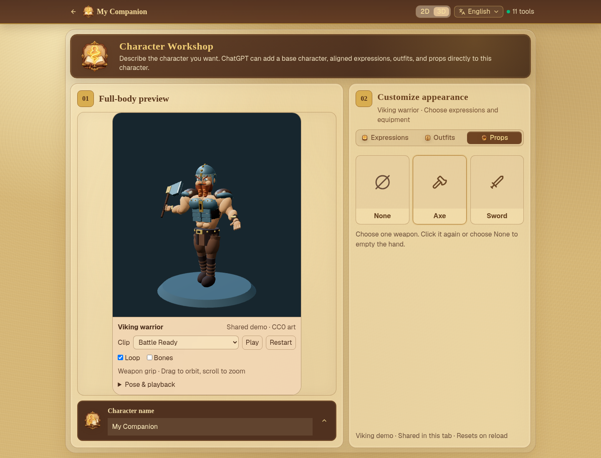
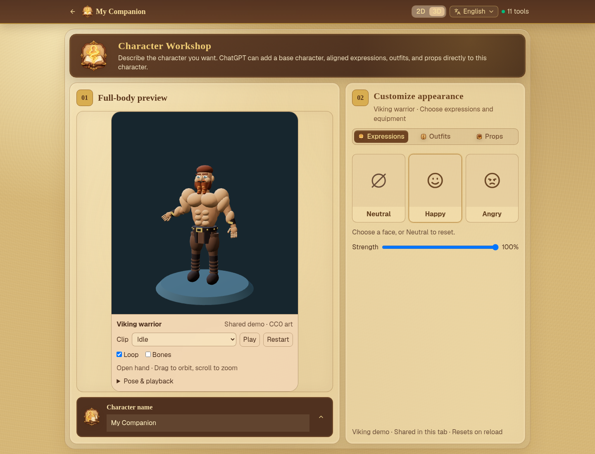

# Game-ready 3D characters and WebMCP

Date: 2026-09-05. Product direction: D排. This replaces the earlier rigid/voxel-first proposal.

## Decision

Deliver self-contained **glTF 2.0 GLB with a skinned humanoid**, using **VRM 1.0 humanoid bone semantics** as the primary bone map. Keep the layered PNG/Pixi workshop separate. Its canvas, painter order, whole-head overlays, and nine authoring tools are not a 3D contract. A voxel viewer is not evidence of a game-ready character pipeline.

Game-ready means an explicit skeleton hierarchy, joints, rest/bind transforms, inverse bind matrices, normalized vertex skin weights and joint indices, plus demonstrable skeletal animation. Morph targets must work alongside skinning. GLB is the delivery container; retain Blender or other authoring sources. A tiny procedural fixture proves the runtime mechanics, not production art quality or arbitrary avatar compatibility.

## Standards and production evidence

| Choice | Evidence and decision |
| --- | --- |
| GLB | glTF defines skins, joint attributes, inverse bind matrices, morph deltas and animation channels. Require embedded resources for the future import profile. [Khronos specification](https://registry.khronos.org/glTF/specs/2.0/glTF-2.0.html) |
| VRM humanoid — primary | Explicit semantic-to-node mapping and required/optional bones make a portable contract. Use names such as hips, spine, head, leftUpperArm, leftLowerArm, leftHand and their leg/right equivalents. Optional chest, neck, shoulders and fingers may enrich it. This spike uses the vocabulary, not the VRMC_vrm extension or a claim of VRM conformance. [Humanoid specification](https://github.com/vrm-c/vrm-specification/blob/master/specification/VRMC_vrm-1.0/humanoid.md) |
| Mixamo — upstream adapter | Useful auto-rigging and animation source. Convert and explicitly map exported joints to the primary semantics; names alone do not establish compatible rest transforms. [Adobe workflow](https://helpx.adobe.com/creative-cloud/help/mixamo-rigging-animation.html) |
| Unity Humanoid — engine adapter | Avatar mapping and T-pose configuration support animation retargeting. Keep this engine configuration outside the portable asset contract. [Unity Avatar configuration](https://docs.unity3d.com/Manual/ConfiguringtheAvatar.html) |
| Modular skeletal characters | Shared animation poses across body and garment meshes are established production practice; merging is an optimization with tradeoffs, not an initial requirement. [Epic modular characters](https://dev.epicgames.com/documentation/en-us/unreal-engine/working-with-modular-characters-in-unreal-engine) |

### Expressions preserve topology

Default to blend shapes (glTF morph targets). Define named presets mapping to mesh/target weights, with zero restoring neutral. VRM expressions combine morph bindings and material/texture-transform bindings, and define binary/override behavior for blink, gaze and mouth combinations. A later VRM adapter must implement these semantics rather than merely copy preset names. [VRM expressions](https://github.com/vrm-c/vrm-specification/blob/master/specification/VRMC_vrm-1.0/expressions.md).

ARKit provides facial coefficient names suitable for tracking-to-rig mapping; it is not a mesh topology or skeleton standard. Production rigs need authored shapes and tested combinations, not just renamed targets. [Apple face anchor](https://developer.apple.com/documentation/arkit/arfaceanchor).

Ready Player Me documents ARKit-compatible morph targets and configurable morph exports. Treat this as a production precedent for a stable head mesh, facial shapes and visemes, not as a service dependency or evidence of current hosted availability. [RPM morph targets](https://docs.readyplayer.me/ready-player-me/api-reference/avatars/morph-targets).

Material presets can change face textures or colors. `KHR_materials_variants` selects preauthored material mappings; it does not deform facial geometry or create clothing. Defer extension support; a future importer must advertise supported bindings. Whole-head replacement is an exceptional asset-family operation, never the default expression mechanism. [Material variants](https://github.com/KhronosGroup/glTF/tree/main/extensions/2.0/Khronos/KHR_materials_variants).

## Authorable wardrobe contract

Use template fit bodies, with versioned skeleton and body-fit identities. Agents can choose catalog garments, author mesh geometry against a supplied template, transfer/paint skin weights in a DCC, export, validate, then preview several poses. Retargeting motion does not fit clothes to a different body.

A proposed garment manifest contains asset hash/license, template body ID/version, skeleton signature (hierarchy + rest transforms), joint mapping, bind matrices, covered body regions, layer/exclusion rules and material presets. Garment and body meshes share the same runtime skeleton only after bind-space compatibility is verified. Hide explicitly authored body regions under clothing; do not guess triangle removal. Require bend/shoulder/hip pose checks and human clipping review. No universal wardrobe compatibility is implied.

Rigid props instead declare a semantic bone socket, local translation/rotation/scale, occupancy and compatible template. A sword follows a hand; a backpack follows a chest socket. These are spatial attachments, with no front/back painter-order semantics. Scale and pivots remain authored; camera framing must not move individual modules.

Future import gates: embedded buffers/textures, bounded bytes/vertices/joints/morphs, finite transforms, normalized weights, valid joint indices, inverse-bind agreement, supported extensions, hashes and explicit license. These are proposed AOZU policy, not properties guaranteed by a GLB suffix. The spike loads only its bundled trusted fixture; arbitrary uploads and a general validator are deferred.

## Minimal Mantle/WebMCP surface

Keep the existing Mantle alpha.14 backbone and Procedure → public MCP Trigger → handler flow. Share one observable preview state between UI and handlers, separate from PNG Character entries. Do not clone the nine 2D operations.

| Atom | Spike behavior | Later scope |
| --- | --- | --- |
| `inspect-3d-character` | Read Viking identity, animation/expression/equipment catalogs, automatic finger poses, playback semantics and session revision | Import diagnostics and fit catalog |
| `configure-3d-preview` | Atomically set clip, play/pause, loop, speed, crossfade, normalized pose seek, armor/helmet visibility, weapon, facial preset/strength and skeleton visibility with expected revision | Persisted composition and validated imported garment/material selections |

Both procedures are real backbone definitions and browser registrations. State is ephemeral, shared across 3D previews in this tab, reset on reload, and never mutates the selected PNG character. One closed configuration contract supplies both Mantle schemas and application validation. Mutation rejects unknown fields/catalog names, stale revisions, nonfinite/out-of-range numbers and invalid types without changing state. The public tool names are `inspect_3d_character` and `configure_3d_preview`. UI controls use the same state command. Rendering remains a browser adapter with no Three dependency in core.

Future persisted composition, inspect/import/validate and export procedures should be introduced only when their storage and conformance guarantees exist. The four Mantle atoms remain architectural building blocks, not a requirement for four UI tools.

## Review of the initial spike

The original `demo-humanoid.glb` establishes a valid 17-joint hierarchy, inverse
bind matrices, normalized blended skinning, one embedded `wave` channel, a `happy`
mouth morph and a hand socket. Three is isolated in the lazy browser adapter and
the core/Mantle path already shares observable revision-checked state with the UI.
These are useful foundations, but not yet a readable character/equipment showcase.
Khronos glTF Validator also found empty child arrays on leaf bones in the original
export. Both generators now omit these invalid arrays, declare buffer targets and
zero unused joint indices; both GLBs validate with zero errors, warnings or hints.

Review gaps addressed in this iteration:

- The adapter always played `animations[0]`; stopping reset the mixer to time zero.
  It now selects named embedded clips, preserves the pose on pause, supports speed,
  looping/hold-at-end and explicit normalized seek, and blends bounded action weights
  across clip changes. Rapid switches retain the current blend and dispose of
  outgoing actions when the fade finishes. [Three AnimationAction](https://threejs.org/docs/pages/AnimationAction.html), [AnimationMixer](https://threejs.org/docs/pages/AnimationMixer.html).
- The original prop was created in the renderer and clothing was deferred. The Viking
  GLB supplies fitted armor and helmet on the body skeleton, plus an axe and sword
  under an authored right-hand socket. Composition uses these named assets.
- A single expression and static hand could not demonstrate a character performing
  different actions while equipped. Two facial morphs and disjoint finger-only clips
  now run alongside six full-body animations; the empty hand opens and the equipped
  hand grips. Neutral clears both face targets without replacing the head mesh.
- The old `happy`/`prop` command is replaced by explicit closed expression/weapon
  catalogs and animation controls. UI and WebMCP execute the same command; neither
  accepts arbitrary paths, animation track payloads or PNG slot semantics.

## Bounded spike: prove and defer

The default bundled **Viking warrior** is original procedural CC0 demo art: a
muscular male with beard, iron helmet, chest/shoulder armor, boots and bracers.
It contains 47 joints (including fingers), separate shared-skeleton armor/helmet,
`happy`/`angry` morph targets (neutral = zero), right-hand axe/sword meshes, six body
clips (`idle`, `walk`, `battle-ready`, `attack`, `cheer`, `wave`) and two hand-pose clips
(`hands-open`, `hands-grip`). The approximately 1.70 MB asset embeds every resource.
Walk is in place; body clips key all body joints so switching is independent of
previous motion. Hand tracks have disjoint bindings and expressions stay independent.

Human controls expose the same composition and playback settings as WebMCP. Play/
pause and speed 0 hold the sampled pose. Disabling loop clamps at the final pose;
Restart or `seek: 0` replays it. `seek` with `playing: false` provides a custom sampled
pose. Crossfade is measured in seconds at 1× speed and freezes on pause. Explicit
seek and paused clip changes apply immediately, without a fade. Configuration is
shared, while mounted viewers keep independent clocks; inspect reports requested
playback state and the last seek command rather than frame-by-frame telemetry.

Equipment uses the existing Character workshop tabs and shared variant-card chrome.
**Outfits** contains independent Armor/Helmet toggles; **None** removes both.
**Props** contains Axe/Sword: choosing one replaces the other, and clicking the
equipped card again or **None** empties the hand. **Expressions** selects Happy/Angry
morphs with a strength slider; **Neutral** resets both morph targets. Equipment and
expression controls live in these slots; transport and Bones remain in the preview.
The workbench is available in 3D even without a PNG body. Switching back to 2D
restores PNG variants, uploads, selection, history and any open variant detail URL.
The catalog and its selected flags are derived from `character3DPreview`, also
returned by `inspect_3d_character`; slot clicks use the same atomic configure command
as WebMCP. No equipment state is copied into the PNG draft.

Checks load the binary with GLTFLoader, verify joint chains, inverse binds, normalized
weights and numeric deformation for **every body clip**, and verify garment motion,
finger deformation, socket following, mutually exclusive morph presets and neutral
restoration. Playback checks cover pause/resume, zero/double speed, loop vs once,
repeated seek, crossfade continuity, rapid switching and disposal. The real compiled
Mantle runtime and registered browser tools are exercised, including schema rejection
and atomic revision conflicts. The focused check remains in `pnpm test`.

Defer: arbitrary GLB/garment import and fit validation, persistent 3D packs/compositions,
engine retarget/export conformance, full VRM runtime, complete ARKit/viseme set,
material variants, physics/root-motion integration, cloth simulation, sculpting,
PNG dual representation and Mantle package upgrades. The procedural art proves
skinning, animation and composition; final art still needs a DCC fit/clipping pass.
Pixi 2D is untouched. This remains a trusted-fixture browser path, not a general
avatar importer or an assertion of compatibility with arbitrary rigs.

Implementation, license, command schema and reproduction:
[public/glb/README.md](../../public/glb/README.md).

## Browser evidence

Chrome desktop captures show the existing workshop slots driving the Viking,
alongside the registered WebMCP surface (a document.modelContext registration harness).
Checked human equipment/expression slot clicks and strength, tool-to-card updates,
stale revision rejection after a slot click, empty-draft access and 390px interaction.
PNG upload, Pixi rendering, outfit selection, prop toggles, undo/redo, retained
variant detail URLs and three 2D/3D round trips also pass, with unchanged PNG draft
state during Viking edits and no duplicate canvases or browser exceptions. This tests
registration and tool execution; native agent/browser discovery remains dependent
on the host browser's WebMCP support.

| Armor + helmet + axe, angry, battle-ready | Unequipped, open hand, happy, idle |
| --- | --- |
|  |  |
